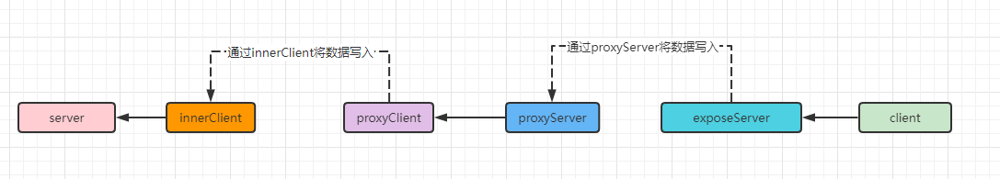
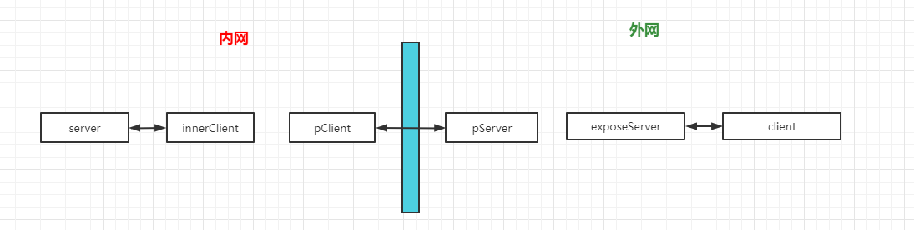
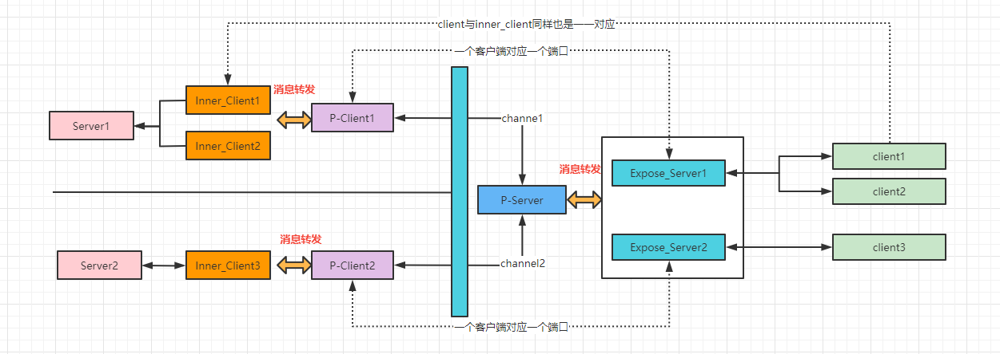
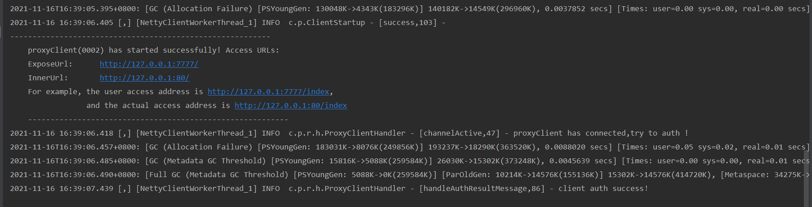
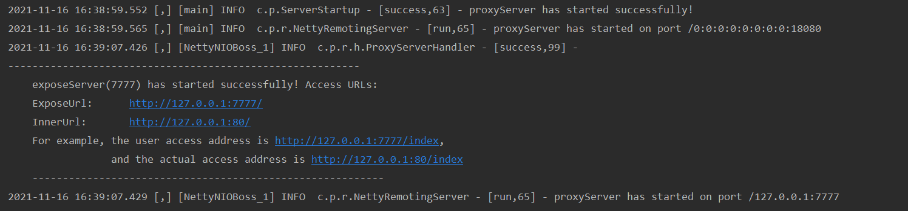

# 一、项目简介
​		inner-proxy是由netty开发的内网穿透工具，支持TCP、HTTP。可将server端部署到外网机器，将客户端部署在内网机器（内网机器必须能够连接互联网）。互联网上的设备可通过服务端暴露出的外网端口进行访问，将请求转发至内网，完成整个调用链路。可用于微信小程序、微信公众号测试，系统演示等相关场景的使用。

# 二、流程说明

## 1. 服务启动流程

（1）pServer服务端启动
（2）pClient客户端启动连接pServer，携带客户端信息，发送认证消息至pServer。
（3）pServer后到认证消息后，根据客户端信息验证客户端认证信息，认证成功后，根据客户端中的exposeServer服务，启动exposeServer服务，用于接收外网连接，服务启动完成后，发送认证结果消息至pClient。

（4）pClient根据认证成功状态进行处理。认证失败时，关闭客户端。认证成功时，完成启动。

## 2. 数据处理流程

### 2.1 数据请求流程

client与exposeServer建立连接后发送数据，exposeServer获取pClient与pServer的channl，将数据发送至

pClient。pClient收到数据后，启动innerClient，连接server，将数据发送至server端。



### 2.2 数据响应流向

server端处理完请求后响应数据至innerClient，innerClient获取pClient与pServer的channl将数据发送到pServre端。pServer获取expose与client的连接，对响应数据进行写入，完成整个代理流程。


## 3.退出流程说明

- client退出,触发ExposeServerHandler#inactive()，发送退出消息，关闭innerClient。

- innerClient退出，触发InnerClientHandler#inactive()，不进行任何处理，当有新的消息进入时，发现连接已经断开，将会重新启动客户端连接server。

- proxyClient退出，触发ProxyServerHandler#inactive()，触发ProxyServerHandler#inactive()方法，关闭与之关联的exposeServer

- proxyServer退出，触发ProxyClientHandler#inactive()，触发ProxyClientHandler#inactive()方法，

# 三、原理介绍

## 1.角色说明
- **client**
  client指的是发起请求的客户端，可能是浏览器、微信小程序、postman、外网服务等等。

- **server**
  server指的是内网服务

- **innerClient**
  为了连接内网服务二启动会的内网客户端，用于将接受到的请求发送至内网服务，以及接受内网服务的响应消息。

- **exposeServer**
  暴露出的外网接口，用于接受客户端发起的请求以及将内网请求转发至客户端。

- **proxyServer**
  代理的服务端，位于外网与内网客户单进行通讯。

- **proxyClient**
  代理的客户端，位于内网与外网的服务端进行通讯

  

  

## 2.原理说明



（1）内网网真正的信息交互是依赖于proxyClient与proxyServer的长链接，完成数据的传递。

（2）如何去接受客户端的请求？这也是exposeServer存在的意义，client与之建立连接，发送请求。

（3）要写将数据发送至server端，需要一个客户端，这个客户端就是innerClient。pClient收到数据之后，通过innerClient将请求发送至server。

# 四、数据协议

## 1. 消息实体

消息主要分为5种类型：认证消息、认证结果消息、连接断开消息、数据传输消息、心跳消息。

```java
@Builder
@NoArgsConstructor
@AllArgsConstructor
@Data
public class ProxyMessage  implements Cloneable{

    /** 认证消息  */
    public static final byte TYPE_AUTH = 0x01;

    /** 认证结果消息 */
    public static final byte TYPE_AUTH_RESULT = 0x02;

    /** 连接断开消息 */
    public static final byte TYPE_DISCONNECT = 0x03;

    /** 数据传输消息 */
    public static final byte TYPE_TRANSFER = 0x04;

    /** 心跳消息 */
    public static final byte TYPE_HEARTBEAT = 0x05;
    /** 类型 */
    private byte type;

    /** 流水号 */
    private String serialNumber;

    /** 额外元数据信息 */
    private String mateData;

    /** 数据实体 */
    private byte[] data;

    public static ProxyMessage disconnectedMessage(){
        return ProxyMessage.builder().type(TYPE_DISCONNECT).build();
    }

    public static ProxyMessage heartbeatMessage(){
        return ProxyMessage.builder().type(TYPE_HEARTBEAT).build();
    }
}
```

## 2.传输协议

### 2.1 数据组成

```
|bodyLength(4)|msgType(1)|snLength(1)|Sn(n)|metaDataLength(4)|metaData(N)|Data(N)|
```

- 消息长度：4字节
- 消息类型：1字节
- 流水号长度：4字节
- 流水号数据：N字节
- 元数据长度：4字节
- 元数据数据：N字节
- Data数据：N字节

### 2.2 编码

```java
public class ProxyMessageEncoder extends MessageToByteEncoder<ProxyMessage> {

    private static final int TYPE_SIZE = 1;

    private static final int SERIAL_NUMBER_SIZE = 1;

    private static final int META_DATA_LENGTH_SIZE = 4;

    @Override
    protected void encode(ChannelHandlerContext ctx, ProxyMessage msg, ByteBuf out) throws Exception {
        int bodyLength = TYPE_SIZE + SERIAL_NUMBER_SIZE + META_DATA_LENGTH_SIZE;
        byte[] metaDataBytes = null;
        byte[] snBytes = null;

        if (msg.getSerialNumber() != null) {
            snBytes = msg.getSerialNumber().getBytes();
            bodyLength += snBytes.length;
        }

        if (msg.getMateData() != null) {
            metaDataBytes = msg.getMateData().getBytes();
            bodyLength += metaDataBytes.length;
        }
        if (msg.getData() != null) {
            bodyLength += msg.getData().length;
        }
        ////|bodyLength(4)|msgType(1)|snLength(1)|Sn(N)|metaDataLength(4)|metaData(N)|Data(N)|
        // write the total packet length but without length field's length.
        out.writeInt(bodyLength);
        out.writeByte(msg.getType());
        if (snBytes != null) {
            out.writeByte((byte) snBytes.length);
            out.writeBytes(snBytes);
        } else {
            out.writeByte((byte) 0x00);
        }

        if (metaDataBytes != null) {
            out.writeInt(metaDataBytes.length);
            out.writeBytes(metaDataBytes);
        } else {
            out.writeInt(0);
        }

        if (msg.getData() != null) {
            out.writeBytes(msg.getData());
        }
    }
}
```

### 2.3 解码

 ```java
public class ProxyMessageDecoder extends LengthFieldBasedFrameDecoder {

    private static final byte HEADER_SIZE = 4;

    private static final int TYPE_SIZE = 1;

    private static final int SERIAL_NUMBER_SIZE = 1;

    private static final int META_DATA_LENGTH_SIZE = 4;

    /**
     * @param maxFrameLength
     * @param lengthFieldOffset
     * @param lengthFieldLength
     * @param lengthAdjustment
     * @param initialBytesToStrip
     */
    public ProxyMessageDecoder(int maxFrameLength, int lengthFieldOffset, int lengthFieldLength, int lengthAdjustment,
            int initialBytesToStrip) {
        super(maxFrameLength, lengthFieldOffset, lengthFieldLength, lengthAdjustment, initialBytesToStrip);
    }

    /**
     * @param maxFrameLength
     * @param lengthFieldOffset
     * @param lengthFieldLength
     * @param lengthAdjustment
     * @param initialBytesToStrip
     * @param failFast
     */
    public ProxyMessageDecoder(int maxFrameLength, int lengthFieldOffset, int lengthFieldLength, int lengthAdjustment,
            int initialBytesToStrip, boolean failFast) {
        super(maxFrameLength, lengthFieldOffset, lengthFieldLength, lengthAdjustment, initialBytesToStrip, failFast);
    }

    @Override
    protected ProxyMessage decode(ChannelHandlerContext ctx, ByteBuf in2) throws Exception {
        ByteBuf in = (ByteBuf) super.decode(ctx, in2);
        if (in == null) {
            return null;
        }

        if (in.readableBytes() < HEADER_SIZE) {
            return null;
        }
        /**
         * bodyLength
         */
        int frameLength = in.readInt();
        if (in.readableBytes() < frameLength) {
            return null;
        }
        ProxyMessage proxyMessage = new ProxyMessage();
        /**
         * type
         */
        byte type = in.readByte();
        proxyMessage.setType(type);
        /**
         * sn
         */
        byte snLength = in.readByte();
        byte[] snByte = new byte[snLength];
        in.readBytes(snByte);
        proxyMessage.setSerialNumber(new String(snByte));

        /**
         * metaData
         */
        int metaDataLength = in.readInt();
        if(metaDataLength>0){
            byte[] metaDataBytes = new byte[metaDataLength];
            in.readBytes(metaDataBytes);
            proxyMessage.setMateData(new String(metaDataBytes));
        }
        /**
         * data
         */
        byte[] data = new byte[frameLength - TYPE_SIZE - SERIAL_NUMBER_SIZE - META_DATA_LENGTH_SIZE - snLength - metaDataLength];
        in.readBytes(data);
        proxyMessage.setData(data);

        in.release();

        return proxyMessage;
    }
}
 ```

### 2.4 拆包粘包处理

```java
protected static final int MAX_FRAME_LENGTH = 2 * 1024 * 1024;

protected static final int LENGTH_FIELD_OFFSET = 0;

protected static final int LENGTH_FIELD_LENGTH = 4;

protected static final int INITIAL_BYTES_TO_STRIP = 0;

protected static final int LENGTH_ADJUSTMENT = 0;

new LengthFieldBasedFrameDecoder(MAX_FRAME_LENGTH, LENGTH_FIELD_OFFSET, LENGTH_FIELD_LENGTH, LENGTH_ADJUSTMENT, INITIAL_BYTES_TO_STRIP);
```

# 五、程序启动

## 1. proxyServer 程序启动 

启动需配置启动参数

```
-p_server_port 18080
```

- p_server_port 服务端口



## 2. proxyClient 程序启动

启动需配置启动参数

```
-p_server_host 127.0.0.1 
-p_server_port 18080 
-client_id 0002 
-client_secret 123456 
-expose_server_host 127.0.0.1 
-expose_server_port 7777 
-inner_host 127.0.0.1 
-inner_port 80
```

- p_server_host ：pServer服务地址

- p_server_port ：pServer服务端口 
- client_id  ：clientID
- client_secret  ：clientSecret
- expose_server_host ：exposeServer服务地址
- expose_server_port ：exposeServer服务端口
- inner_host  ：内网地址
- inner_port ：内网端口

